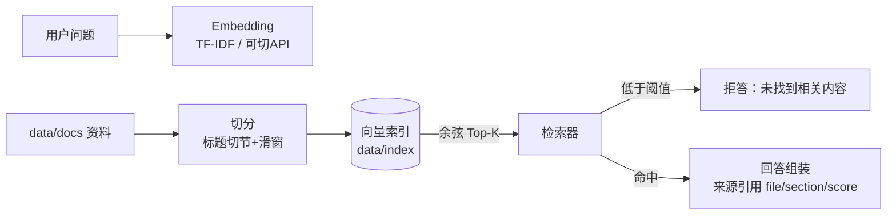

# 课程资料知识库问答系统（RAG）


> 简历项目：上传 Markdown 资料 → 按标题与长度切分 → 向量化入库 → 检索问答（来源引用 + 无答案拒答）→ 40 条评测集对比切分长度与 Top-K 的影响。**默认零密钥离线可跑**（本地 TF-IDF Embedding，crc32 确定性哈希 + 平滑 IDF）；真实 API Embedding 未内置，需自行接入（见「评测结论」边界说明）。

## 快速开始

```bash
pip install -r requirements.txt --target vendor     # 已预装可跳过
export PYTHONPATH="$(pwd)/vendor"
python scripts/make_docs.py        # 生成 8 篇模拟课程资料
python scripts/build_eval.py       # 生成 40 条评测集（可答 20 / 拒答 20）
python scripts/build_index.py      # 构建向量索引 → data/index/（含 matrix.npy + idf.npy）
python -m uvicorn app.main:app --port 8040    # Swagger: /docs

python eval/run_eval.py            # 6 组评测矩阵 → reports/eval_report.md
python -m pytest tests             # 8 例单测（切分/检索/引用/拒答/持久化一致性/路径安全）
```

## 接口

| 方法 | 路径 | 说明 |
|---|---|---|
| POST | /api/upload | 上传 .md/.markdown/.txt 资料（切分入库，IDF 全量重算） |
| GET | /api/search?query=&top_k= | 检索片段（文件/章节/相似度） |
| POST | /api/ask | 问答：回答 + sources 引用 + 无答案拒答 |
| GET/DELETE | /api/documents[/{name}] | 知识库管理 |

## 架构（mermaid）



## 评测结论（本机实测，拒答阈值 0.21）

| 切分长度 | Top-K | 命中% | 引用覆盖% | 拒答正确% |
|---|---|---|---|---|
| 500 | 3 | **100** | **100** | 95 |
| 500 | 5 | **100** | **100** | 95 |
| 300 | 3 | 100 | 100 | 95 |

- **切分 500 + Top-3/5 均达命中/引用 100%、拒答 19/20（95%）**；完整 6 组矩阵与失败样例见 [reports/eval_report.md](reports/eval_report.md)。
- 拒答阈值按评测集得分分布选定：可答题最低分 0.215（全保），超纲题最高 0.267(R03)（唯一词面撞车泄漏，19/20=95%）；次高 0.206(R20) 低于阈值不会泄漏。阈值是"答错"与"不答"的权衡旋钮，调参依据写进了 [app/core.py](app/core.py)。
- TF-IDF 对词面重合型问题有效；同义改写与超纲词面撞车需真实 Embedding API（本实现未内置切换接口，需自行接入），向量库可平移 FAISS。

## 面试深挖点

1. **为什么纯 TF 会失灵、IDF 解决什么**：全库高频样板句（"核心思想可以概括为"）在纯 TF 下主导余弦得分，rare 但有区分度的词（dijkstra）被淹没——加平滑 IDF 后命中率 95%→100%，可现场复述评测矩阵。
2. **`hash()` 随机化踩坑**：维度映射最初用 Python 内置 `hash()`，受 `PYTHONHASHSEED` 影响，持久化索引在另一进程全部失配（评测脚本同进程内建索引所以没暴露）→ 换 `crc32` 跨进程稳定哈希。
3. **拒答阈值怎么定**：不是拍脑袋——画可答/超纲两分布，取 0.21（可答 20/20 + 拒答 19/20），阈值即"答错 vs 不答"的业务权衡。
4. **切块策略**：标题切节 + 节内滑窗，块带 metadata(file/section/pos)，引用可以细到章节。
5. **离线可复现**：向量确定性（crc32）、评测集可再生成、零密钥零网络——评测矩阵任何人一键复现。

## 验证记录（2026-09-14 复验）

- `python -m pytest tests` → **8 passed**（切分/检索/引用/拒答 4 例 + 持久化一致性/路径安全回归 4 例）。
- `python eval/run_eval.py` → 6 组配置 命中/引用 100%，拒答 95%（报告已再生成；结论第 2 条改为由实测数据计算生成）。
- 服务冒烟（uvicorn 8040）：`快速排序的时间复杂度` → 正确引用《数据结构_图与排序.md》；`图书馆开门时间` → 正确拒答；`Dijkstra算法的思想` → 返回答案且正主文档在 sources（排 #2，词面模型已知边界）。

---

## 产品视角（面试可讲）

- **目标用户**：需要查课程资料的学生；可平移到任何"只答有依据问题"的知识库场景。
- **解决的问题**：通用大模型对私有资料会编造；本系统只答有引用的内容，无依据明确拒答。
- **核心场景**：上传讲义 → 提问 → 带引用（文档·章节·相关度）的回答 → 库外问题拒答；Top-K 1–20 可调。
- **产品入口**：`uvicorn app.main:app --port 8040` 后浏览器打开 **/demo**——问答页，引用来源与拒答状态可视化。
- **成功指标（实测）**：40 条评测集，可答命中/引用 100%、拒答 95%（阈值 0.21 有推导依据）。
- **未来计划**：语义 embedding + FAISS 升级检索；文档增量更新；答案质量接 agent-eval 黄金集回归。
